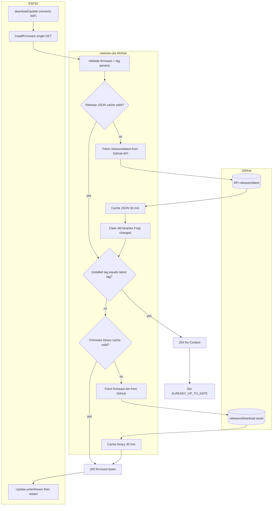
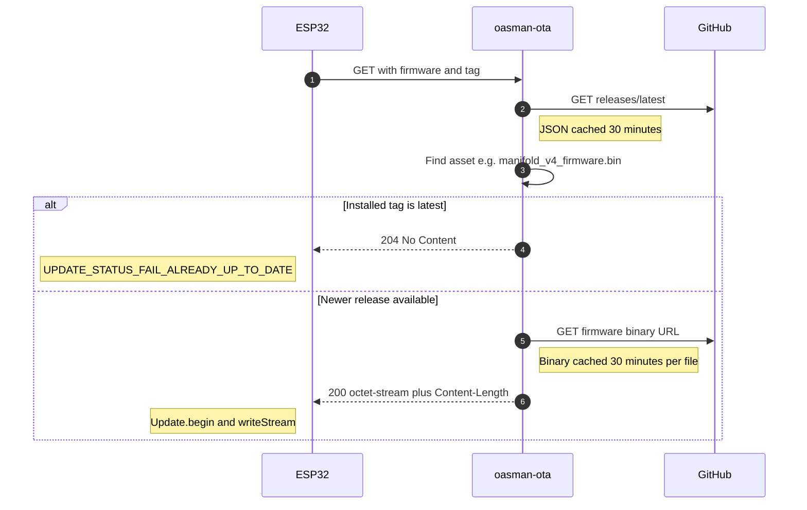

# oasman-ota OTA flow

ESP32 [`directdownload.cpp`](./directdownload.cpp) calls one URL:

`http://oasman-ota.gopro2027.workers.dev/?firmware=<name>&tag=<installed-tag>`

Implementation: [`oasman-ota_worker.js`](./oasman-ota_worker.js)

---

## Flowchart (recommended in VS Code preview)

---

## Sequence diagram (same flow, chat-style)

---

## Plain-text summary

| Step | Who | What |
|------|-----|------|
| 1 | ESP32 | `GET oasman-ota?firmware=...&tag=...` |
| 2 | Worker | Load or fetch `releases/latest` (30 min cache) |
| 3 | Worker | If GitHub tag changed since last cache, delete old `*_firmware.bin` caches |
| 4 | Worker | If `tag` param equals `tag_name` → **204** (already up to date) |
| 5 | Worker | Else find `{firmware}_firmware.bin`, serve from cache or GitHub → **200** |
| 6 | ESP32 | Flash via `Update` API and restart |
