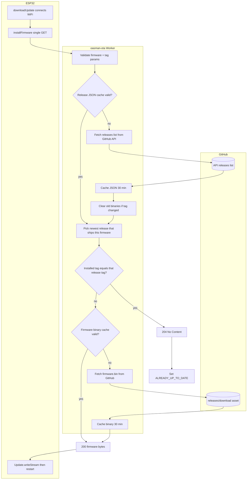
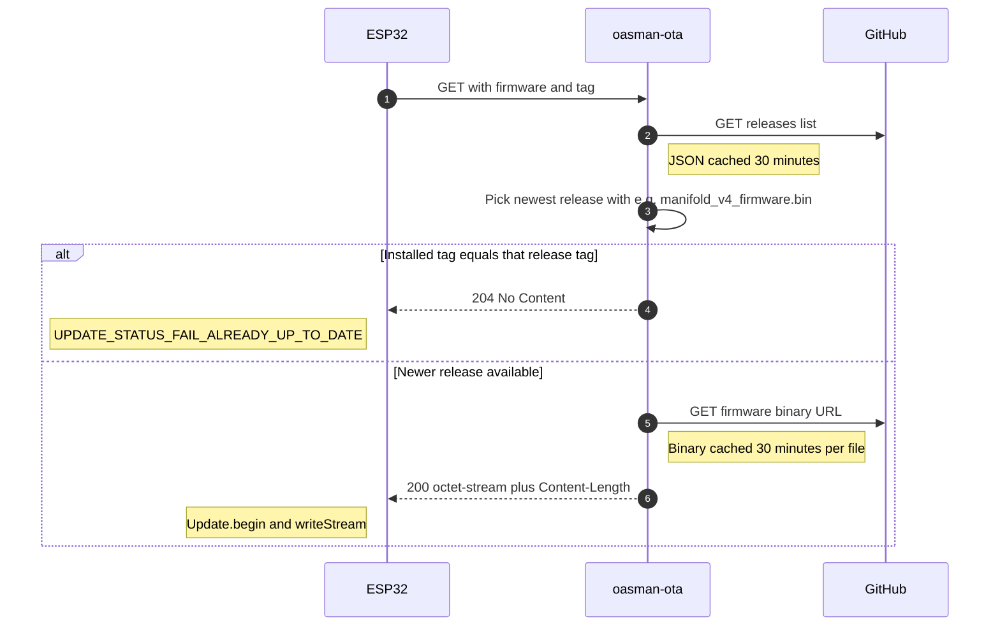

# oasman-ota OTA flow

ESP32 [`directdownload.cpp`](./directdownload.cpp) calls one URL:

`http://oasman-ota.gopro2027.workers.dev/?firmware=<name>&tag=<installed-tag>`

Implementation: [`oasman-ota_worker.js`](./oasman-ota_worker.js)

---

## Flowchart (recommended in VS Code preview)

```mermaid
flowchart TB
    subgraph esp32 [ESP32]
        A[downloadUpdate connects WiFi]
        B[installFirmware single GET]
        C[Update.writeStream then restart]
    end

    subgraph worker [oasman-ota Worker]
        D[Validate firmware + tag params]
        E{Release JSON cache valid?}
        F[Fetch releases list from GitHub API]
        G[Cache JSON 30 min]
        M[Pick newest release that ships this firmware]
        H{Installed tag equals that release tag?}
        I{Firmware binary cache valid?}
        J[Fetch firmware.bin from GitHub]
        K[Cache binary 30 min]
        L[Clear old binaries if tag changed]
    end

    subgraph github [GitHub]
        API[(API releases list)]
        BIN[(releases/download asset)]
    end

    A --> B
    B --> D
    D --> E
    E -->|yes| M
    E -->|no| F
    F --> API
    API --> G
    G --> L
    L --> M
    M --> H
    H -->|yes| R204["204 No Content"]
    H -->|no| I
    I -->|yes| R200["200 firmware bytes"]
    I -->|no| J
    J --> BIN
    BIN --> K
    K --> R200
    R204 --> ESP204[Set ALREADY_UP_TO_DATE]
    R200 --> C
```

---

## Sequence diagram (same flow, chat-style)

```mermaid
sequenceDiagram
    autonumber
    participant ESP as ESP32
    participant OTA as oasman-ota
    participant GH as GitHub

    ESP->>OTA: GET with firmware and tag
    OTA->>GH: GET releases list
    Note right of OTA: JSON cached 30 minutes

    OTA->>OTA: Pick newest release with e.g. manifold_v4_firmware.bin

    alt Installed tag equals that release tag
        OTA-->>ESP: 204 No Content
        Note left of ESP: UPDATE_STATUS_FAIL_ALREADY_UP_TO_DATE
    else Newer release available
        OTA->>GH: GET firmware binary URL
        Note right of OTA: Binary cached 30 minutes per file
        OTA-->>ESP: 200 octet-stream plus Content-Length
        Note left of ESP: Update.begin and writeStream
    end
```

---

## Plain-text summary

| Step | Who | What |
|------|-----|------|
| 1 | ESP32 | `GET oasman-ota?firmware=...&tag=...` |
| 2 | Worker | Load or fetch `releases` list (30 min cache) |
| 3 | Worker | If newest GitHub tag changed since last cache, delete old `*_firmware.bin` caches |
| 4 | Worker | Pick the newest release that actually ships `{firmware}_firmware.bin` |
| 5 | Worker | If `tag` param equals that release's `tag_name` → **204** (already up to date) |
| 6 | Worker | Else serve `{firmware}_firmware.bin` from that release, cache or GitHub → **200** |
| 7 | ESP32 | Flash via `Update` API and restart |
